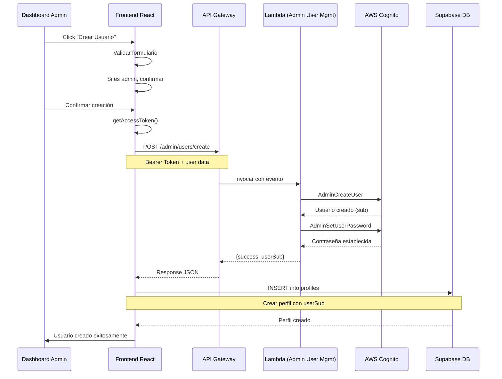

# 🔐 Creación de Usuarios Admin con AWS Cognito

## ✅ Implementación Completada

Se ha implementado un sistema completo para la creación de usuarios desde el dashboard administrativo usando AWS Cognito en lugar de Supabase Auth.

---

## 🎯 Recomendaciones Implementadas

### 1. ✅ Validaciones de Seguridad

**Implementadas en el Frontend** ([UserManagement.tsx](../../src/components/admin/UserManagement.tsx)):

- ✅ **Validación de email**: Formato correcto usando regex
- ✅ **Validación de contraseña fuerte**:
  - Mínimo 8 caracteres
  - Al menos una letra minúscula
  - Al menos una letra mayúscula
  - Al menos un número
- ✅ **Verificación de email único**: Comprueba que el email no exista antes de crear
- ✅ **Validación de campos requeridos**: Nombre completo obligatorio
- ✅ **Mensajes de error claros**: Feedback específico para cada tipo de error

### 2. ✅ Confirmación para Admins

**Diálogo de confirmación especial** cuando se crea un usuario con rol admin:

```tsx
// Si el rol es admin, muestra diálogo de confirmación adicional
if (formData.role === "admin") {
  setShowAdminConfirm(true); // Muestra diálogo extra
  return;
}
```

Características:

- ✅ Muestra email y nombre del futuro admin
- ✅ Advierte sobre permisos completos
- ✅ Requiere confirmación explícita
- ✅ Botón de cancelación disponible

### 3. ✅ Estados de UI Mejorados

- ✅ **Estados de carga**: Botones deshabilitados durante operaciones
- ✅ **Textos dinámicos**: "Creando...", "Procesando..."
- ✅ **Validación en tiempo real**: Errores mostrados debajo de cada campo
- ✅ **Indicadores visuales**: Campos con error en rojo

---

## 🏗️ Arquitectura del Sistema

### Flujo de Creación de Usuario



### Componentes del Sistema

#### 1. **Frontend** - `src/components/admin/UserManagement.tsx`

- Formulario con validaciones
- Confirmación para admins
- Llamada a API Gateway con token

#### 2. **Service Layer** - `src/services/admin.ts`

```typescript
export async function createUser(userData) {
  // 1. Obtener API Gateway URL
  // 2. Obtener access token de Cognito
  // 3. POST a /admin/users/create
  // 4. Crear perfil en Supabase con el sub
}
```

#### 3. **Lambda Function** - `infrastructure/lambda/admin-user-management/index.js`

- Valida datos de entrada
- Crea usuario en Cognito con AdminCreateUser
- Establece contraseña permanente
- Retorna el sub (ID único de Cognito)

#### 4. **API Gateway** - `infrastructure/lib/api-gateway-stack.ts`

- Ruta: `POST /admin/users/create`
- Autorización: Cognito User Pool
- Integración: Lambda Proxy

#### 5. **Lambda Stack** - `infrastructure/lib/lambda-functions-stack.ts`

- Define la función Lambda
- Permisos IAM para Cognito Admin APIs

---

## 🔑 Configuración Requerida

### Variables de Entorno

#### Frontend (`.env`)

```bash
REACT_APP_API_GATEWAY_URL=https://your-api-id.execute-api.us-east-1.amazonaws.com/dev
```

#### Lambda (configurado en CDK)

```bash
USER_POOL_ID=us-east-1_xxxxx
AWS_REGION=us-east-1
```

### Permisos IAM

La Lambda necesita estos permisos en Cognito:

```typescript
actions: ["cognito-idp:AdminCreateUser", "cognito-idp:AdminSetUserPassword", "cognito-idp:AdminGetUser", "cognito-idp:ListUsers"];
```

---

## 🚀 Deployment

### 1. Instalar dependencias de Lambda

```bash
cd infrastructure/lambda/admin-user-management
npm install
```

### 2. Desplegar infraestructura con CDK

```bash
cd infrastructure
npm run build
cdk deploy LambdaFunctionsStack-dev
cdk deploy ApiGatewayStack-dev
```

### 3. Verificar outputs

```bash
# Obtener URL de API Gateway
aws cloudformation describe-stacks \
  --stack-name ApiGatewayStack-dev \
  --query "Stacks[0].Outputs[?OutputKey=='ApiUrl'].OutputValue" \
  --output text
```

### 4. Configurar Frontend

Actualizar `.env` con la URL del API Gateway obtenida.

---

## 🧪 Testing del Flujo

### Test Manual desde el Dashboard

1. **Login como Admin**

   ```
   Email: admin@fullvision.com
   Password: Tu contraseña de admin
   ```

2. **Navegar a Dashboard**

   ```
   /admin/dashboard → Pestaña "Usuarios"
   ```

3. **Crear Usuario Regular**

   ```
   Email: test@example.com
   Password: Test1234
   Nombre: Usuario Test
   Rol: Cliente
   ```

4. **Crear Usuario Admin** (con confirmación)
   ```
   Email: admin2@fullvision.com
   Password: Admin1234
   Nombre: Admin Secundario
   Rol: Administrador
   → Confirmar en diálogo adicional
   ```

### Validaciones a Probar

#### Debe Fallar:

- ❌ Email sin @
- ❌ Contraseña < 8 caracteres
- ❌ Contraseña sin mayúscula
- ❌ Contraseña sin número
- ❌ Email ya existente
- ❌ Nombre vacío

#### Debe Pasar:

- ✅ Email válido + contraseña fuerte
- ✅ Crear cliente sin confirmación extra
- ✅ Crear admin con confirmación extra
- ✅ Usuario aparece en tabla después de creación
- ✅ Perfil creado en Supabase con mismo ID (sub)

---

## 🔍 Debugging

### Ver logs de Lambda

```bash
aws logs tail /aws/lambda/full-vision-admin-user-management-dev --follow
```

### Verificar usuario en Cognito

```bash
aws cognito-idp admin-get-user \
  --user-pool-id us-east-1_xxxxx \
  --username test@example.com
```

### Verificar perfil en Supabase

```sql
SELECT * FROM profiles WHERE email = 'test@example.com';
```

### Errores Comunes

#### 1. "API Gateway URL no configurada"

**Solución**: Configurar `REACT_APP_API_GATEWAY_URL` en `.env`

#### 2. "No se pudo obtener el token de acceso"

**Solución**: Usuario no está autenticado. Hacer logout/login

#### 3. "UsernameExistsException"

**Solución**: Email ya existe en Cognito. Usar otro email.

#### 4. "InvalidPasswordException"

**Solución**: Cognito User Pool tiene políticas de contraseña más estrictas. Revisar configuración del pool.

#### 5. Error 403 en API Gateway

**Solución**: Token de Cognito inválido o expirado. Renovar sesión.

---

## 📊 Comparación: Antes vs Después

| Aspecto                     | Antes (Supabase Auth)    | Después (Cognito)                 |
| --------------------------- | ------------------------ | --------------------------------- |
| **Autenticación**           | Supabase Auth Admin API  | AWS Cognito Admin SDK             |
| **Creación desde Frontend** | ❌ No permitido          | ✅ Sí, vía Lambda                 |
| **Validaciones**            | ⚠️ Básicas               | ✅ Completas (frontend + backend) |
| **Confirmación Admin**      | ❌ No                    | ✅ Sí                             |
| **Integración**             | Directa                  | API Gateway + Lambda              |
| **Seguridad**               | ⚠️ Service Role expuesta | ✅ Lambda aislada                 |
| **Escalabilidad**           | ⚠️ Limitada              | ✅ Auto-scaling                   |

---

## 🔮 Próximas Mejoras (Opcional)

### 1. Sistema de Invitación por Email

```typescript
// En lugar de establecer contraseña
MessageAction: "RESEND"; // Envía email con link temporal
```

### 2. Roles más Granulares

```typescript
type Role = "super_admin" | "manager" | "customer";
```

### 3. Logs de Auditoría

```typescript
// Registrar quién creó qué usuario y cuándo
await supabase.from("audit_logs").insert({
  action: "user_created",
  admin_id: currentUserId,
  target_user: newUserId,
});
```

### 4. Límite de Rate

```typescript
// En Lambda, limitar creaciones por admin
const recentCreations = await checkRecentCreations(adminId);
if (recentCreations > 10) throw new Error("Rate limit");
```

---

## 📚 Referencias

- [AWS Cognito Admin APIs](https://docs.aws.amazon.com/cognito/latest/developerguide/cognito-user-pools-admin-user-creation.html)
- [API Gateway Lambda Integration](https://docs.aws.amazon.com/apigateway/latest/developerguide/set-up-lambda-integrations.html)
- [AWS CDK Lambda Functions](https://docs.aws.amazon.com/cdk/api/v2/docs/aws-cdk-lib.aws_lambda-readme.html)

---

## ✅ Checklist de Implementación

- [x] Validaciones de email y contraseña
- [x] Verificación de email único
- [x] Confirmación para crear admins
- [x] Estados de carga en UI
- [x] Lambda function creada
- [x] API Gateway endpoint configurado
- [x] Permisos IAM correctos
- [x] Sincronización con Supabase profiles
- [x] Manejo de errores completo
- [x] CORS configurado
- [ ] Desplegar a AWS (pendiente)
- [ ] Testing en producción (pendiente)

---

## 🎉 Resultado Final

**Has conseguido un sistema de gestión de usuarios completamente funcional que:**

✅ Permite a administradores crear usuarios desde el dashboard  
✅ Integra AWS Cognito para autenticación  
✅ Mantiene perfiles sincronizados con Supabase  
✅ Incluye validaciones robustas de seguridad  
✅ Requiere confirmación para crear administradores  
✅ Proporciona feedback claro al usuario  
✅ Es escalable y seguro

**¡Tu sistema Full Vision está listo para gestionar usuarios de manera profesional con AWS Cognito!** 🚀
